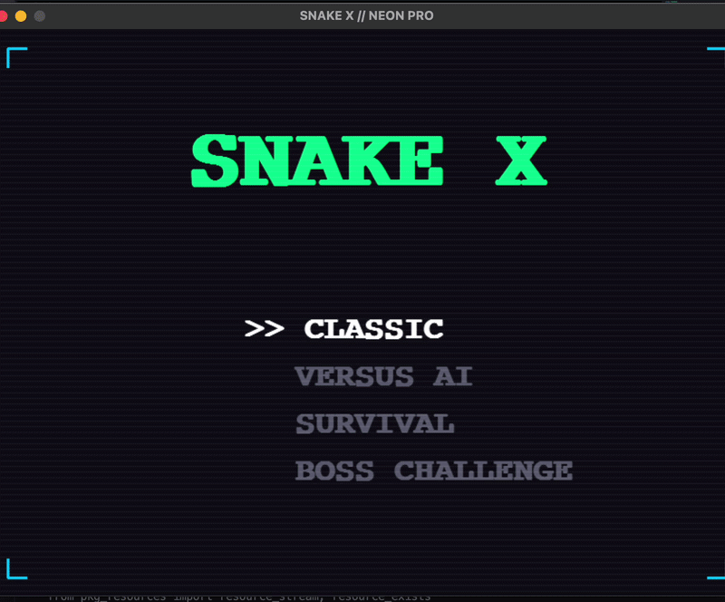

# 🐍 SNAKE X // NEON PRO

A high-octane, Cyber-Neon arcade experience built with Python and Pygame.

  

## ✨ Features

- **4 Distinct Game Modes:** Classic, Versus AI, Survival, and Boss Challenge.
- **Neural-Path AI:** A greedy-algorithm opponent that hunts the food in real-time.
- **Ghost Mode:** Press `G` to phase through walls and enemies.
- **Retro Visuals:** CRT Scanlines, neon vignettes, and segmented pixel-art snakes.

## 🕹️ Controls

- **Arrows:** Movement
- **G Key:** Activate Ghost Mode (5s cooldown)
- **Enter:** Select Menu Option
